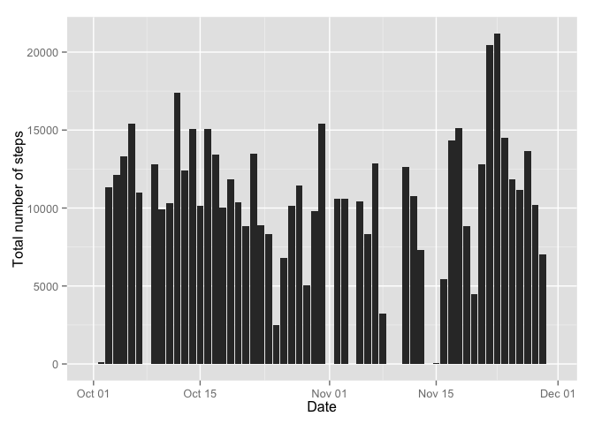
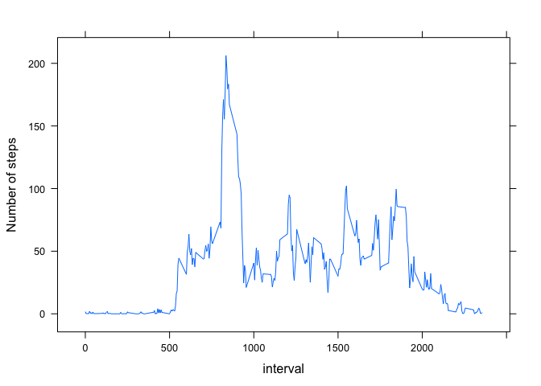
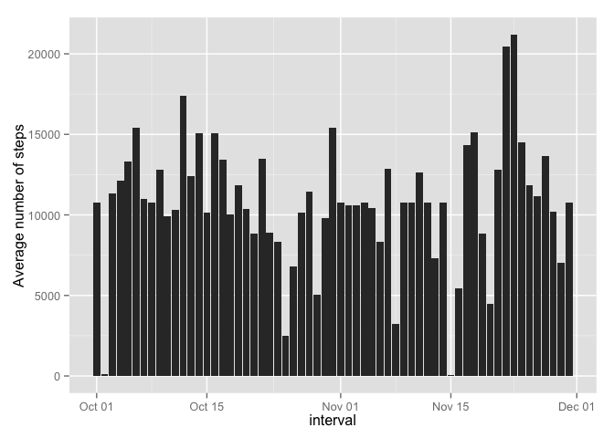

# Reproducible Research: Peer Assessment 1


## Loading and preprocessing the data

```r
library(plyr)   # for ddply()
library(lattice)  # for xyplot()
library(ggplot2)  # for histogram plotting

# Open CSV file
df <- read.csv("activity.csv")

# format 'date' column as Date object
df$date = as.Date(df$date, format="%Y-%m-%d")
```

## What is mean total number of steps taken per day?
Total number of steps taken per day

```r
per_day_summary1 <- ddply(df, .(date), summarize, sum=sum(steps, na.rm=TRUE))

# plot histogram of 'total number of steps taken per day'
q1 <- qplot(x=per_day_summary1$date, y=per_day_summary1$sum, geom="histogram", stat="identity", xlab="Date", ylab="Total number of steps")
q1 + scale_x_date()
```

 

Mean of the total number of steps taken per day

```r
mean(per_day_summary1$sum, na.rm = TRUE)
```

```
## [1] 9354.23
```

Median of the total number of steps taken per day

```r
median(per_day_summary1$sum, na.rm = TRUE)
```

```
## [1] 10395
```


## What is the average daily activity pattern?
1. Make the time series plot of the 5-minute interval (x-axis) and the average number of steps taken, averaged across all days (y-axis)

```r
interval_summary1 <- ddply(df, .(interval), summarize, ave=mean(steps, na.rm=TRUE))
xyplot(ave ~ interval, data=interval_summary1, type="l", xlab="interval", ylab="Number of steps")
```

 

2. Calculate and report the interval contains the max of steps, on average across all the days

```r
maxAve1 <- max(interval_summary1$ave)
interval_summary1[interval_summary1$ave == maxAve1, ]
```

```
##     interval      ave
## 104      835 206.1698
```


## Imputing missing values
1. Calculate and report the total number of missing values in the dataset

```r
missing <- is.na(df$steps)
sum(missing)
```

```
## [1] 2304
```

2.  Devise a imputation strategy that use the mean for that 5-minute interval for filling missing value

```r
impute_fun <- function(interval_key) {
  interval_summary1[interval_summary1$interval == interval_key, ][["ave"]]
}
```

3.  Create a new dataset that all NA values are imputed.

```r
# Create a new dataset now
imputed <- df
missed_interval <- df[missing,][["interval"]]

# Fill-in the missing 'steps'
imputed[missing,][["steps"]] <- sapply(missed_interval, impute_fun)
```

4a. Make a histogram of the total number of steps taken each day, with imputed 'steps'

```r
per_day_summary2 <- ddply(imputed, .(date), summarize, sum=sum(steps, na.rm=TRUE))
q2 <- qplot(x=per_day_summary2$date, per_day_summary2$sum, geom="histogram", stat="identity", xlab="interval", ylab="Average number of steps")
q2 + scale_x_date()
```

 

4b. Calculate and report the new mean of total number of steps taken per day

```r
mean(per_day_summary2$sum, na.rm=TRUE)
```

```
## [1] 10766.19
```

4b. Calculate and report the new median of total number of steps taken per day

```r
median(per_day_summary2$sum, na.rm=TRUE)
```

```
## [1] 10766.19
```

####Finding: The mean and the median of the imputed dataset is larger than that of the original data set.

## Are there differences in activity patterns between weekdays and weekends?
1. Create a new factor variable in the dataset with two levels - "weekday" and "weekend" indicating whether a given date is a weekday or weekend day.

```r
imputed$day_type <- factor(
                      weekdays(as.Date(imputed$date)) %in% c("Saturday", "Sunday"),
                      labels = c("weekday", "weekend"))
```

2. Make a panel plot containing a time series plot (i.e. type = "l") of the 5-minute interval (x-axis) and the average number of steps taken, averaged across all weekday days or weekend days (y-axis)

```r
interval_summary2 <- ddply(imputed, .(interval, day_type), summarize, ave=mean(steps, na.rm=TRUE))
xyplot(ave ~ interval | day_type, data = interval_summary2, type="l", xlab="interval", ylab="Number of steps", layout=c(1,2))
```

 
